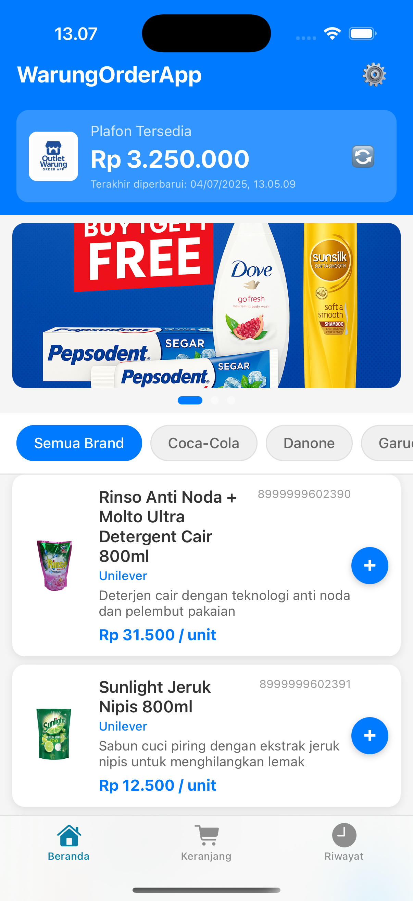
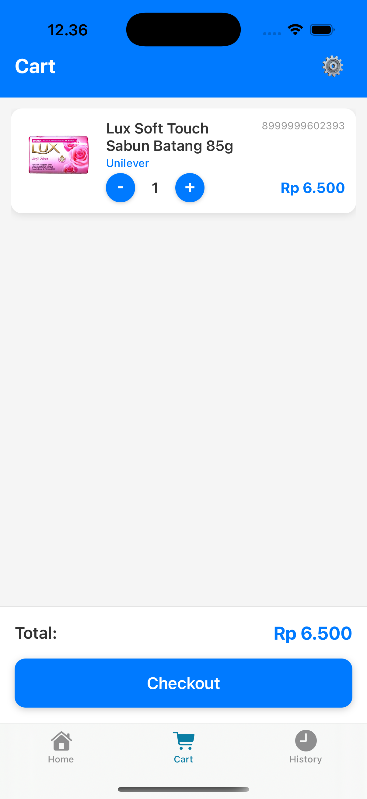
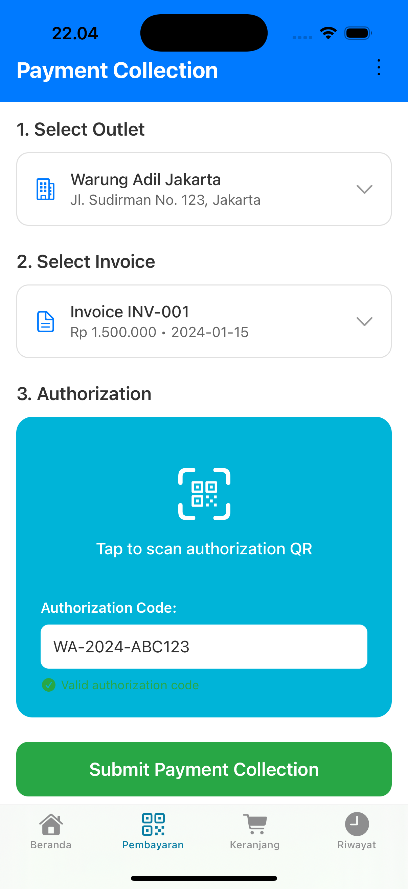
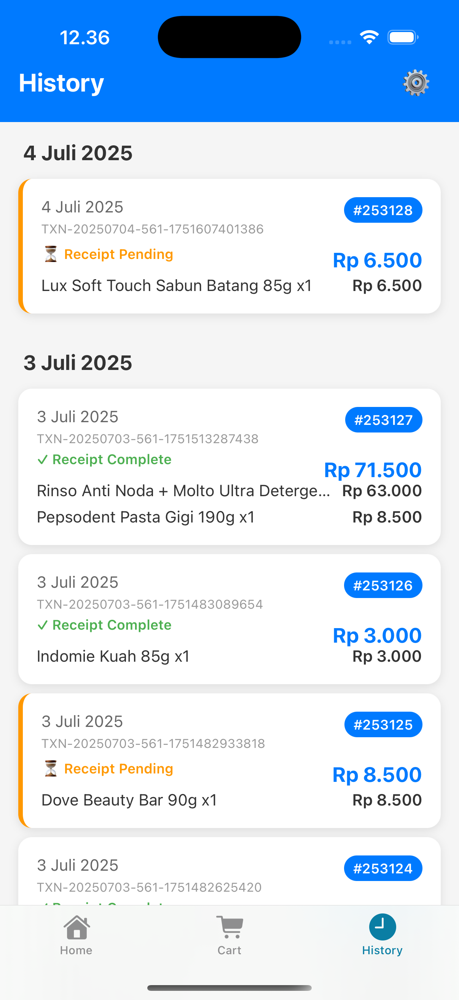

# Sales Order App

A comprehensive sales application designed for salespeople to manage orders and collect payments on behalf of warungs (small shops) in Indonesia. This app enables sales representatives to browse products, place orders for outlets, and collect payments with QR code authorization.

## Overview

This sales app serves as a mobile tool for salespeople who work with multiple warung outlets. It allows them to:

- **Browse Products**: View catalog with filtering by brand
- **Order on Behalf**: Place orders for specific outlets
- **Payment Collection**: Collect payments from outlets with QR authorization
- **Transaction Management**: Track order history and payment status

## Key Features

### 🛒 **Order Management**
- Browse and filter products by brand
- Add items to cart with quantity management
- Place orders on behalf of specific outlets
- View order history and transaction details

### 💰 **Payment Collection**
- Select outlet and invoice for payment collection
- Scan QR codes from Warung Adil app for authorization
- Manual authorization code entry as fallback
- Real-time validation of authorization codes
- Transaction confirmation and success tracking

### 🏪 **Outlet Management**
- Dropdown selection of available outlets
- Outlet details (ID, name, address)
- Invoice filtering by selected outlet
- Pending invoice management

### 📱 **User Experience**
- Multi-language support (Bahasa Indonesia & English)
- Progressive disclosure workflow
- Real-time validation and feedback
- Clean, intuitive interface for sales workflow

## Project Structure

```
sales-order-app/
  ├── app/                # App screens and navigation
  │   ├── (tabs)/        # Main tab screens (home, cart, payment, history)
  │   ├── confirmation.tsx  # Order confirmation screen
  │   ├── success.tsx    # Success screen for different scenarios
  │   └── order-detail.tsx # Order detail view
  ├── assets/             # Images and fonts
  ├── components/         # Reusable UI components
  │   ├── ProductImage.tsx # Product image component
  │   ├── PaymentMethodCard.tsx # Payment method display
  │   └── ui/            # UI components
  ├── constants/          # App-wide constants
  ├── contexts/           # React contexts (cart, language)
  ├── data/               # Mock data (products, outlets, invoices)
  ├── hooks/              # Custom React hooks
  ├── services/           # Local storage service
  ├── scripts/            # Utility scripts
  ├── package.json        # Project dependencies
  └── README.md           # This file
```

## Sales Workflow

### 1. **Product Browsing & Ordering**
- Salesperson browses product catalog
- Filters products by brand
- Adds items to cart with quantities
- Places order on behalf of selected outlet

### 2. **Payment Collection Process**
1. **Select Outlet**: Choose which outlet to collect payment from
2. **Select Invoice**: Pick specific invoice for payment collection
3. **Authorization**: Scan QR code from Warung Adil app or enter manually
4. **Confirmation**: Submit payment collection with outlet confirmation

### 3. **Transaction Tracking**
- View order history and payment status
- Track successful payment collections
- Access transaction details and receipts

## Screenshots

Below are some example screens from the app (images are mock/demo only):

- **Home**: Product catalog with banner carousel and brand filtering
  

- **Cart**: Shopping cart with quantity management for outlet orders
  

- **Payment Collection**: Outlet selection, invoice picking, and QR authorization
  

- **History**: Transaction history and payment collection records
  

## Technical Notes

- **Mock Data**: All data is local and mocked for demo purposes
- **No Real API**: No actual API integration or sensitive credentials
- **Safe for Demo**: All company-specific information has been removed
- **React Native**: Built with Expo and React Native
- **TypeScript**: Full TypeScript support for type safety

## Usage

1. Clone the repository
2. Install dependencies: `npm install`
3. Run the app: `npm start`

## Target Users

This app is designed for:
- **Sales Representatives**: Who work with multiple warung outlets
- **Field Sales Teams**: Who need mobile tools for order management
- **Payment Collectors**: Who collect payments from various outlets

## License
MIT
